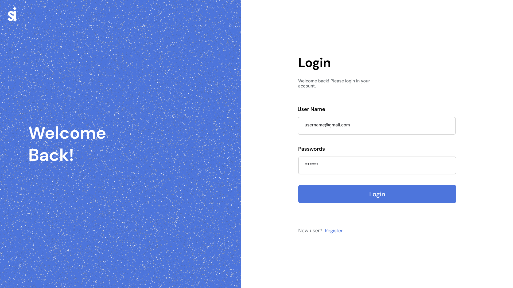

# API Sécurisée

Solution au test technique réalisé avec [Next.js](https://nextjs.org/), [Tailwind](https://tailwindcss.com/) en frontend et 
En backend, [Express.js](https://expressjs.com/), [Mongoose](https://mongoosejs.com/) et [JWT](https://jwt.io/).

- [Site Live](https://api-secure-tau.vercel.app/login) 
- Backend déployé sur [Render](https://render.com/) 
- Frontend déployé avec [Vercel](https://vercel.com/) 

##### J'espère que ma solution convient à vos attentes :blush: